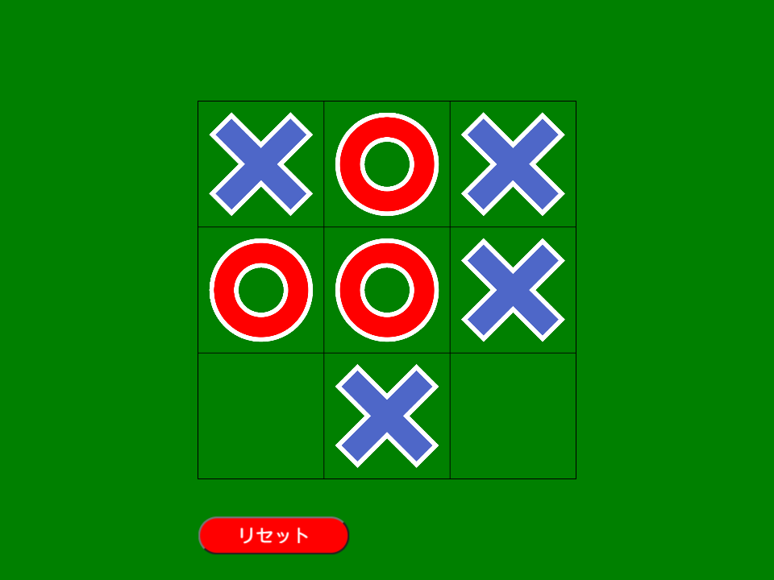

# tictactoe-js
Tictactoe with ml5.js

Play on [GitHub Pages](https://yamamoto-yuta.github.io/tictactoe-js/)

* This game optimized to touch input, do not optimized to mouse click.

# Dataset
- [sfujiwara/tictactoe-tensorflow](https://github.com/sfujiwara/tictactoe-tensorflow)